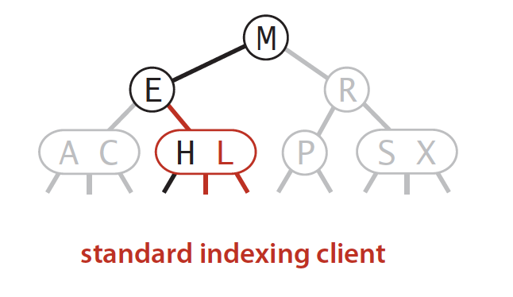
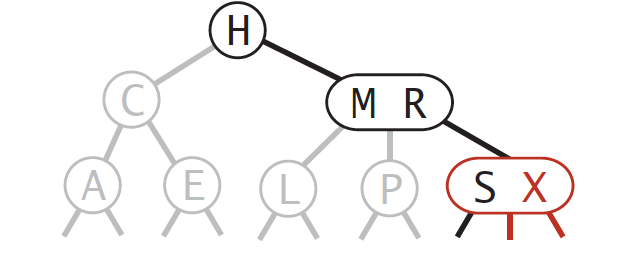

# An educational 2-3 tree visualizer (work in progress)

## Correctness

Since it can be difficult to visually see what's going on a in a 2-3 tree, a pretty print function helps immensely (See [prettyPrint.ts](./src/lib/util/prettyPrint.ts)).
Let's take an example taken directly from the Algorithms book by Robert Sedgewick and Kevin Wayne and apply it directly to our tree object. We expect to see a structure that looks like this:

### Example 1 - page 430 of the Algorithms Book



### Code

```js
const tree23 = new TwoThreeTree();
const chars = ['S', 'E', 'A', 'R', 'C', 'H', 'X', 'M', 'P', 'L'];
for (const char of chars) {
	tree23.insert(char);
}
prettyPrint(tree23.root);
```

Which gives us the following result:

```bash
│               ┌──── [S | X]
│       ┌──── [R]
│       │       └──── [P]
└──── [M]
        │       ┌──── [H | L]
        └──── [E]
                └──── [A | C]
```

This result confirms that the tree works correctly for insertion operations, but for clarity lets take another example.

### Example 2 (3Node) - page 430 of the Algorithms Book



```js
const tree23 = new TwoThreeTree();
const chars = ['A', 'C', 'E', 'H', 'L', 'M', 'P', 'R', 'S', 'X'];
for (const char of chars) {
	tree23.insert(char);
}
prettyPrint(tree23.root);
```

Which gives us the following result:

```bash
│                   ┌──── [S | X]
│                   ┌──── [P]
│       ┌──── [M | R]
│       │           └──── [L]
└──── [H]
        │       ┌──── [E]
        └──── [C]
                └──── [A]
```

Despite the pretty print output, it is perhaps still hard to clearly see how these operations take place, and this is where a visualization tool can come in very handy!
Every insert operation leads to some change in the tree, and it's important to capture these changes to really understand what is happening.
